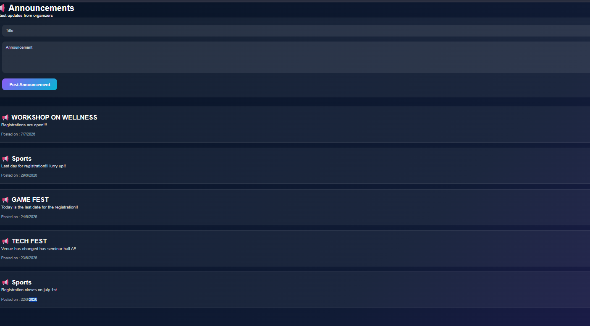

# 🎓 EventHub – College Event Management System

## 📖 Overview

**EventHub** is a full-stack College Event Management System designed to simplify the process of managing college events. It provides an easy-to-use platform for administrators to create and manage events, while students and visitors can explore events and register seamlessly.

The project is built using **HTML, CSS, JavaScript, Node.js, Express.js, and MongoDB**, offering a modern and responsive interface with secure backend functionality.

---

# ✨ Features

## 👨‍💼 Admin Features

* Secure Login
* Dashboard with Event Statistics
* Create New Events
* Edit Existing Events
* Delete Events
* Manage Event Registrations
* Publish Announcements
* Manage Notifications
* View Registered Participants

---

## 👨‍🎓 Student Features

* User Registration
* Secure Login
* Browse Available Events
* View Event Details
* Register for Events
* View My Registrations
* Profile Management
* Notifications

---

## 👥 Visitor Features

Visitors can:

* View all upcoming events
* View complete event details
* Register for events **without creating an account**
* Provide Name, Email, and Phone Number for registration

---

# 🛠️ Technologies Used

### Frontend

* HTML5
* CSS3
* JavaScript

### Backend

* Node.js
* Express.js

### Database

* MongoDB
* Mongoose

### Tools

* Git
* GitHub
* Visual Studio Code
* Postman

---

# 📂 Project Structure

```text
College-Event-Management
│
├── backend
│   ├── src
│   ├── models
│   ├── routes
│   ├── controllers
│   ├── middleware
│   ├── package.json
│   └── server.js
│
├── frontend
│   ├── announcements
│   ├── create-event
│   ├── dashboard
│   ├── edit-event
│   ├── event-details
│   ├── events
│   ├── login
│   ├── my-registrations
│   ├── notifications
│   ├── profile
│   ├── register
│   ├── registrations
│   ├── settings
│   ├── forgot-password
│   ├── index.html
│   ├── style.css
│   └── JavaScript files
│
└── README.md
```
# 📸 Project Screenshots

## 🔑 Login Page


---

## 📊 Dashboard


---

## 🎉 Events Page


---

## 📄 Event Details


---

## 📝 Registrations


---

## 📢 Announcements


---

# 🚀 Installation

## Clone the Repository

```bash
git clone https://github.com/balamakhilasai04-pixel/College-Event-Management.git
```

## Navigate to the Project

```bash
cd College-Event-Management
```

## Install Backend Dependencies

```bash
cd backend
npm install
```

## Configure Environment Variables

Create a `.env` file inside the `backend` folder.

Example:

```env
PORT=5000
MONGO_URI=your_mongodb_connection_string
JWT_SECRET=your_secret_key
```

## Start the Backend Server

```bash
npm start
```

or

```bash
nodemon src/server.js
```

## Run the Frontend

Open:

```
frontend/index.html
```

using **Live Server** in Visual Studio Code.

---

# 📌 Main Modules

* Home Page
* Login
* Registration
* Forgot Password
* Dashboard
* Events
* Event Details
* Visitor Registration
* Create Event
* Edit Event
* My Registrations
* Registrations Management
* Announcements
* Notifications
* Profile
* Settings

---

# 🔒 Authentication

* User Registration
* Secure Login
* Role-Based Access
* JWT Authentication
* Password Encryption using bcrypt

---

# 📊 Database

MongoDB is used to store:

* Users
* Events
* Registrations
* Announcements
* Notifications

---

# 🎯 Future Enhancements

* Email Notifications
* QR Code Event Check-In
* Attendance Tracking
* Certificate Generation
* Online Payment Integration
* Event Analytics

---

# 👩‍💻 Developer

**Akhila Balam**

GitHub:

https://github.com/balamakhilasai04-pixel

---

# 📄 License

This project is developed for educational and academic purposes.
